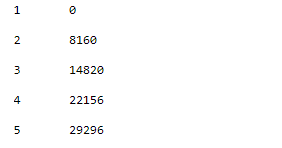

# 1. Dataset 

- dataset을 직접 만들어봅니다.

___

## 1.1. dataset download
- vgg2 face dataset: http://www.robots.ox.ac.uk/~vgg/data/vgg_face2/
- data: train sef만 사용 (dir: 8631개, file: 3,141,890개)
- [download dataset for ubuntu](https://github.com/shiney5213/Project-Face_Recognition/blob/master/data_src/1.1.get_dataset_on_ubuntu.py)
 

## 1.2. face detection & align 112 x 112
- [mtcnn 이용](https://github.com/shiney5213/Project-Face_Recognition/blob/master/data_src/1.2.face_crop_112x112(MTCNN).ipynb)
- [haar_cascade 이용](https://github.com/shiney5213/Project-Face_Recognition/blob/master/data_src/1.2.face_crop_112x112(haar_cascade).ipynb)
- file: 3,123,756개 사용
 

## 1.3. dir to lst 
- image file에 대한 정보를 나타내는 파일
- [make lst file](https://github.com/shiney5213/Project-Face_Recognition/blob/master/data_src/1.3.dir2lst.ipynb)
- align 여부, image path, label로 구성
 

## 1.4. property
- num_classes, img_size, img_size
- vgg2_face_dataser:   8631, 112, 112
- [property file](https://github.com/shiney5213/Project-Face_Recognition/blob/master/data_src/1.4.property.ipynb)

## 1.5. face to rec, idx
### 1.5.1. [idx 살펴보기](https://github.com/shiney5213/Project-Face_Recognition/blob/master/data_src/1.5.view_idx_file.ipynb)
- image에 대한 정보를 저장
- img_id, s로 구성


### 1.5.2. [idx 만들기](https://github.com/shiney5213/Project-Face_Recognition/blob/master/data_src/1.5.face2rec2(mxnet).ipynb)
- lst file에서 image정보를 불러와 image_list 만들기
 
- 개별 이미지에 대한 정보 (item.flag =0)
    - HEADER(flag=0, label=[0, 1], id=151, id2=0)
    - flag: 개별 이미지
    - label: [ label, alignde]
    - id : img_index (아래 코드에서 item[0]과 같음.)

```
if item.aligned:
	with open(fullpath, 'rb') as fin:
		img = fin.read()
s = mx.recordio.pack_img(header, img, quality=args.quality, img_fmt=args.encoding)
	       
record.write_idx(item[0], s)
```

- 디렉터리에 대한 메타 정보를 저장 (item.flag = 2)
    -  HEADER(flag=2, label=[537.0, 564.0], id=595, id2=0)
    -  flag: 메타 정보
    -  label: [id_start , id_end] (같은 label인 img index)

```
s = mx.recordio.pack(header, b'')

record.write_idx(item[0], s)
```
### 1.5.2. rec 파일 만들기
```
record = mx.recordio.MXIndexedRecordIO(os.path.join(working_dir, fname_idx),
                                       os.path.join(working_dir, fname_rec), 'w')
                                       
record.write_idx(item[0], s)
```
### 1.5.3.[ idx와 rec](https://github.com/shiney5213/Project-Face_Recognition/blob/master/data_src/1.5.view_rec%2Cidx_file(vgg2dataset).ipynb)
- 두 개의 파일을 이용해서 이미지에 대한 메타 정보와 이미지를 가져올 수 있음.

```
header, s = recordio.unpack(imgrec.read_idx(1))
img = mx.image.imdecode(s).asnumpy() 
```

## 1.6. rec,idx to img
- train.rec, train.idx를 통해 img로 변환해서 저장
- [이미지로 저장](https://github.com/shiney5213/Project-Face_Recognition/blob/master/data_src/1.6.prepare_data(InsightFace_Pytorch).ipynb)
```
def load_mx_rec(rec_path):
    save_path = rec_path/'imgs'
    if not save_path.exists():
        save_path.mkdir()
    imgrec = mx.recordio.MXIndexedRecordIO(str(rec_path/'train.idx'), str(rec_path/'train.rec'), 'r')
    img_info = imgrec.read_idx(0)
    header,_ = mx.recordio.unpack(img_info)
    max_idx = int(header.label[0])
    for idx in tqdm(range(1,max_idx)):
        img_info = imgrec.read_idx(idx)
        header, img = mx.recordio.unpack_img(img_info)
        print(type(img))
        label = int(header.label[0])
        label_path = save_path/str(label)
        if not label_path.exists():
            label_path.mkdir()
        cv2.imwrite(f'{label_path}/{idx}.jpg',img, [cv2.IMWRITE_JPEG_QUALITY, 95])
```

## 1.7. 전체 process 살펴보기

---

## Reference

-  https://github.com/deepinsight/insightface/issues/791
-  https://github.com/deepinsight/insightface/issues/256